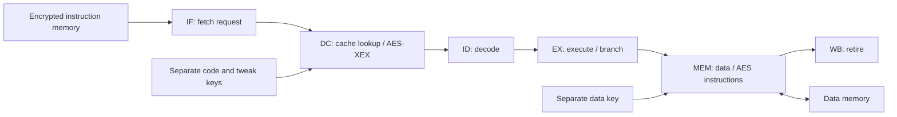

# CryptoCPU architecture

CryptoCPU implements the original 2025 thesis idea: instruction ciphertext
is read from memory, decrypted inside the processor and reused from an internal
instruction cache. The current implementation makes the instruction encodings,
memory interfaces and validation explicit.

## Execution path



The pipeline executes in order, forwards dependent values, stalls for a
load-use hazard and resolves branches in EX without delay slots. Redirects
discard younger instructions and any in-flight wrong-path fetch. Faults retire
after older instructions; status and end PC identify how execution stopped.

The core supports arithmetic, shifts, logic, multiply/divide with HI/LO,
byte/halfword/word memory operations, conditional branches, jumps and calls
within its MIPS32 subset. It does not implement the complete MIPS architecture.
Private opcodes `0x3A` and `0x3B` implement `aesenc $rt, $rs` and
`aesdec $rt, $rs`: read a 16-byte data block at the address in `$rs`, transform
it under `k_data`, and write it to the address in `$rt`.

## Memory and instruction encryption

| Parameter | Value |
| --- | --- |
| Instruction memory | 4,096 words (16 KiB), base `0x00400000` |
| Data memory | 4,096 words (16 KiB), base `0x10010000` |
| Initial stack pointer | End of data memory |
| AES block | Four 32-bit instruction words, 128 bits total |
| Default active cache | Eight direct-mapped lines, 128 bytes of instruction data excluding tags |
| Supported cache sizes | Powers of two from 1 to 64 lines |

For instruction block index `b`, the image format is:

```text
T[b] = AES-128-Encrypt(k_tweak, nonce[0] || nonce[1] || 0 || b)
C[b] = AES-128-Encrypt(k_code, P[b] XOR T[b]) XOR T[b]
P[b] = AES-128-Decrypt(k_code, C[b] XOR T[b]) XOR T[b]
```

Each concatenated field is 32 bits; the nonce is 64 bits. The AES routines pack
each word most-significant byte first. This is the repository's AES-XEX block
format with separately derived tweaks, not an XTS file format. A distinct nonce
should be assigned to each image under a reused key pair. At a fixed key, nonce
and address, encryption is deterministic.

The core never writes through its instruction-memory interface. Decrypted
instructions occupy internal cache entries, pipeline registers and temporary
values. Data memory remains ordinary readable/writable memory, except for
blocks explicitly transformed by the AES data instructions. The three keys
are independent inputs, rather than fields hidden in the program image.

## Cycle model

The design point uses a four-cycle instruction-block read and an eleven-cycle
modeled AES service latency. An encrypted miss is charged their sum; a cache
hit bypasses that miss service. Plaintext mode uses the same pipeline and cache
with the AES miss charge removed. Data AES instructions also use the configured
AES service latency.

A main-loop iteration counts one modeled pipeline cycle. Key expansion and
initialization occur before that counter starts. The model does not separately
schedule every AES operation needed to derive a tweak and decrypt a block;
multiply/divide are also single-cycle operations in this model. The default
latencies are modeling assumptions, not synthesized scheduling results.

The cache arrays have space for 64 lines even when fewer lines are active.
Consequently, the configured eight-line cache does not establish a particular
BRAM allocation. [Hardware integration](hardware-flow.md) explains how to
derive physical timing and utilization from the generated RTL.

## Protection boundary

The intended adversary can inspect or modify stored instruction ciphertext,
but does not have the code/tweak keys or access to internal plaintext state.
The model evaluates this interface separation. Key provisioning, access
control, debug access and physical isolation belong to the surrounding system.

XEX supplies encryption without an authentication tag. Address-dependent
tweaks disrupt repeated-block patterns and simple relocation, but exceptions
after tampering are not cryptographic integrity checks. Replay, access-pattern
leakage and physical side channels are outside the evaluated protection.

## Continuity with the original work

| Original design aim | Current implementation |
| --- | --- |
| Execute encrypted instructions | AES-128 instruction blocks decrypted by the DC stage |
| Keep plaintext inside the processor | Read-only instruction input and internal decrypted cache/pipeline |
| Limit decryption cost | Cache hits reuse already decrypted instruction blocks |
| Provide processor AES operations | Separate-key `aesenc` and `aesdec` data instructions |
| Target an FPGA workflow | Fixed-size C++ arrays and HLS interfaces, with a documented integration procedure |

The main improvements are standard subset decoding, separate keys,
address-dependent encryption and comparison against a reference interpreter.
Assembler alignment, malformed key files and incomplete tamper-result
comparison have targeted regression coverage. The [archive](../legacy/README.md)
retains the 2025 implementation; [CHANGES.md](../legacy/CHANGES.md) explains the differences.
