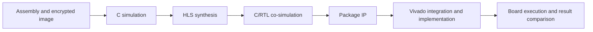

# Vitis HLS, Vivado and board integration

This chapter describes the implementation procedure for the CryptoCPU sources:
the flow that took the thesis prototype from C++ to an Artix-7 XC7A200T (AC701
board), where it met timing at 75 MHz and ran the encrypted program. Its
measured figures, and resource estimates for the present configuration, are in
Section V of the [paper](../paper/cryptocpu.pdf). The host tests and cycle-model
experiments are in the [verification notes](validation.md).



## 1. Fix the inputs

Record the source SHA-256 hashes, Vitis/Vivado versions, FPGA part, board revision
and requested clock period. Use the board's schematic and master XDC for clocks,
reset polarity, package pins and voltage standards. The archived diagram
does not determine the pinout of a new integration.

Assemble a program and run its host check first:

```text
python tools/asm.py tests/programs/signature.s -o build/progs/signature
build/cryptocpu_tb build/progs/signature
```

The directory contains `text.hex`, `data.hex` and `symbols.txt`. The testbench
constructs the encrypted instruction image before calling the CPU. For board
loading, use `image_tool encrypt` and a separate key file as described in the
main README. Load ciphertext into `imem` and initial data into `dmem`; supply
matching keys and nonce through the control interface. Keep the original data
image separate from a previous run's output.

## 2. Configure the HLS component

Select `cryptocpu_top` as the top function. Add these design sources:

| File | Role |
| --- | --- |
| `src/cryptocpu.cpp` | Pipeline and top-level interfaces |
| `src/aes128.cpp` | AES-128 encryption, decryption and key expansion |
| `src/xex.cpp` | Address-dependent instruction encryption |
| `src/cryptocpu.h`, `src/aes128.h` | Fixed-size types and declarations |

Use `tests/cryptocpu_tb.cpp` as the testbench, with `ref/isa_ref.cpp` as a
testbench-only source and the include paths for `src`, `ref` and `tests`. The
reference interpreter and file-loading helpers are outside the synthesized
top-level hierarchy. Set the testbench argument to the program directory;
use an absolute path when the simulator has a different working directory.

Run C simulation, synthesize for the selected part, and inspect the scheduling
and interface reports. Resolve any source or interface restrictions reported
by the selected HLS version. A model iteration counts one simulated CPU cycle;
the generated RTL schedule determines physical latency and throughput.
AMD describes the component stages in [Running C Synthesis](https://docs.amd.com/r/en-US/ug1399-vitis-hls/Running-C-Synthesis).

## 3. Check RTL behavior

Run C/RTL co-simulation with the same inputs and expected results. Compare
status, end PC, all registers, HI/LO and data memory; use the testbench's nonzero
exit status to report failure. Include an arithmetic program, a branch/load
hazard program, AES data instructions and an exception case.

A matching C/RTL result establishes agreement on those inputs. It relies on the
testbench checking the intended calculation. AMD's
[RTL verification flow](https://docs.amd.com/r/en-US/ug1399-vitis-hls/Automatically-Verifying-the-RTL)
returns simulated RTL outputs to that testbench for checking. For Tcl-based
projects, [`cosim_design -argv`](https://docs.amd.com/r/en-US/ug1399-vitis-hls/cosim_design)
passes the program-directory argument.

## 4. Package and connect the IP

Export the verified RTL as an IP and add it to the Vivado project. Use the
generated port list and address map when connecting:

| Interface | Connection |
| --- | --- |
| Clock and reset | Board clock source, clock generation and synchronized reset |
| `imem` | Instruction storage containing the AES-XEX image; read-only during execution |
| `dmem` | Read/write data storage initialized from `data.hex` |
| `keys`, `cfg` | Control-side provisioning before starting the core |
| `state`, `stats` | Result readback after completion |
| Start / completion | Controller implementing the generated block-level protocol |

The current source requests BRAM interfaces for memories and AXI-Lite interfaces
for control/state arguments. Inspect the generated representation of pointers
and structures before writing a loader. Decide how to restrict key readback
and control access in the surrounding system. The separate C++ key argument
does not itself implement an eFUSE, BBRAM or trusted provisioning mechanism.

## 5. Implement and record measurements

Validate the block design, apply the board constraints, run synthesis and
implementation, then inspect timing and utilization before generating a
bitstream. Retain the implementation checkpoint, XDC and tool reports together.

| Quantity | Evidence to retain |
| --- | --- |
| Clock target and achieved timing | Timing summary, WNS/TNS and unconstrained-path checks |
| LUT, FF, BRAM, DSP use | Utilization report for the selected FPGA |
| Execution duration | Hardware cycle counter or an external timing measurement, with clock frequency |
| Power | Power-analysis report with its activity assumptions, or a documented board measurement |

Use report values for the exact build. The C++ `stats.cycles` value is a modeled
pipeline count; it is not a direct measurement of FPGA clock cycles. Vivado's
[implementation reports](https://docs.amd.com/r/en-US/ug904-vivado-implementation/Viewing-Implementation-Reports)
cover timing, clocks and power analysis.

## 6. Execute and check results on the board

Program the FPGA, reset the core, load the encrypted code and fresh data, supply
keys/configuration, and start execution. After completion, read the result state
and relevant data words and compare them with the reference output saved for
the same program. Repeat after reset and with a second program/input.

Use separate indicators for completion and the result comparison. An `ap_done`
event reports that the HLS transaction finished; a PASS indicator requires the
expected computation to match. Initialize result locations to a different value
before the run so that an old answer cannot satisfy the check. See AMD's
[block-level protocol description](https://docs.amd.com/r/2020.2-English/ug1399-vitis-hls/Block-Level-I/O-Protocols).

Archive the bitstream, image hashes, board configuration, observed outputs and
reports with the source revision. This associates each hardware result with
the build that produced it.
